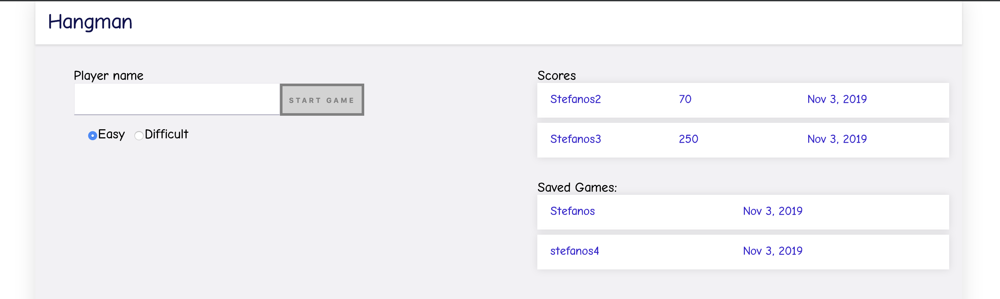
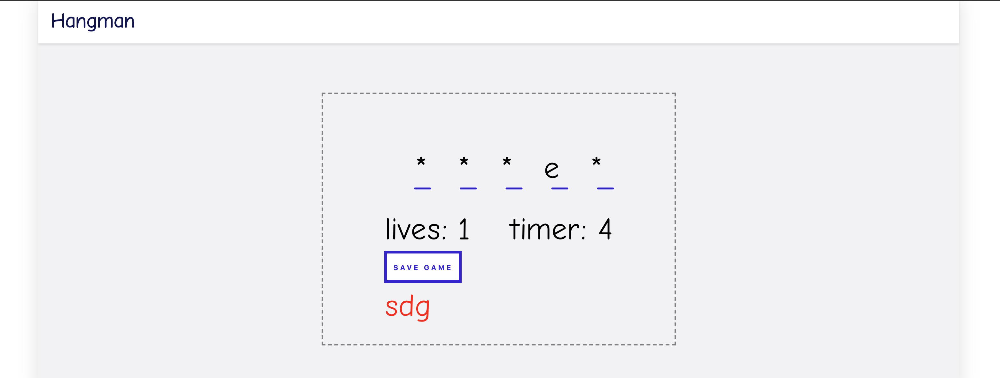
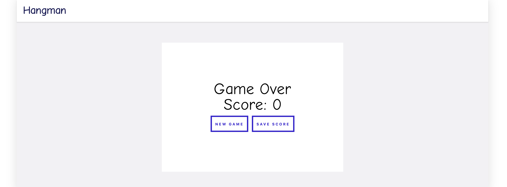

### Angular-Flask

- [Description](#description)
- [How to run the application locally](#how-to-run-the-application-locally)
  - [Server](#server)
  - [Client](#client)
- [Request & Response Examples](#request--response-examples)
- [Architecture](#architecture)
- [Improvements](#improvements)

### Description

This project is the implentation of the Hangman game. Hangman is a guessing game for two or more players. One player thinks of a word, phrase or sentence and the other(s) tries to guess it by suggesting letters or numbers, within a certain number of guesses.

In our case, we have a bunch of predefined words stored in our server and for every game we return to the player one of this words randomly.

The application consists of two pages. On the first page, the user must fill out his name(required) and then can start a new game. There are available two modes for the game, an EASY and a DIFFICULT. The mode(level of difficulty) represents the time that the user has between his/her guesses. The score is calculated also based on the mode that the user has selected.

On this page there are also two lists. One list for the saved scores and one list for the saved games. When a game ends, the user can save the score. During the game the user can also save the game. When the user saves a game, we store in the database the current state of the game. later he/she can continue playing the game from that point (**By using the redux design pattern for the implementation it was extremely easy to implement this feature - state hydration**).

- First page
  

On the second page there are the spaces for the letters of the word, a timer(the time that the user has in order to select a letter), the wrong characters that he has selected and a button to save the current status of the game on the server.

- Second page
  

When the gane ends the score appears and two buttons, one to save the score on the server and one top start a new game.

- Game Results
  

### How to run the application locally

#### Server

Run the following commands in order:

1. [install docker](https://docs.docker.com/docker-for-mac/install/)
2. `cd server`
3. `docker-compose up -d --build` (run first `docker-compose down` if you have already run this command before)
4. `docker-compose exec api python manage.py create_db`
5. `docker-compose exec api python manage.py seed_db`

#### Client

Run the following commands in order:

1. `cd client`
2. `npm i`
3. `npm run start`
4. [http://localhost:4200/](http://localhost:4200/)

**If you have any problem to run the server/client locally, please contact me or preferably open an issue**

## Request & Response Examples

### API Resources

- [GET /words](#get-words)
- [POST /words](#post-words)
- [GET /scores](#get-scores)
- [POST /scores](#post-scores)
- [GET /games](#get-games)
- [POST /games](#post-games)

### GET /words

Description: Get a random word from the server

Example:

    curl -i -H 'Accept: application/json' http://localhost:5000/words

Response body:

    {
        "word": "marvin"
    }

### POST /words

Description: Add a new word to the database

Example:

    curl -d '{"word":"value1"}' -i -H 'Content-Type: application/json' -X POST http://localhost:5000/words

Request body:

    {
        "word": "marvin2"
    }

### GET /scores

Description: Get the scores

Response body:

    {
        "status": "success",
        "scores": [
            {
                "id": 1,
                "username": "Stefanos2",
                "score": 70,
                "created_date": "2019-11-03 10:53:44.544143"
            },
            {
                "id": 2,
                "username": "Stefanos3",
                "score": 250,
                "created_date": "2019-11-03 11:01:05.209822"
            }
        ]
    }

### POST /scores

Description: Save user's score to the database

Request body:

    {
        "username": "Stefanos6",
        "score": 250
    }

### GET /games

Description: Get saved games

Response body:

    {
        "status": "success",
        "states": [
            {
                "id": 1,
                "username": "Stefanos",
                "state": "{\"word\":\"print\",\"progressWord\":[\"*\",\"*\",\"i\",\"*\",\"*\"],\"character\":\"i\",\"wrongChars\":[\"s\",\"o\"]}",
                "created_date": "2019-11-03 10:53:20.481272"
            },
            {
                "id": 2,
                "username": "stefanos4",
                "state": "{\"word\":\"layer\",\"progressWord\":[\"*\",\"*\",\"*\",\"*\",\"*\"],\"character\":\"f\",\"wrongChars\":[\"s\",\"d\",\"f\",\"f\"]}",
                "created_date": "2019-11-03 11:01:27.091380"
            }
        ]
    }

### POST /games

Description: Save user's game to the database

Request body:

    {
        "username": "Stefanos7",
        "state": "{\"word\":\"print\",\"progressWord\":[\"*\",\"*\",\"*\",\"*\",\"*\"],\"character\":\"o\",\"wrongChars\":[\"s\",\"f\",\"a\",\"o\"]}"
    }

### Architecture

* We need to reduce the initial loading time of our app, so the gameboard module is a lazy loaded module.
* For the state management we used NgRx which is a library that implements the Redux design pattern based on the RxJS library.
* The benefits that we get from NgRx in this app is that we can share the state between our components/pages, the seperation of concerns principle that we followed(all the API request are located on the effects, the business logic to our reducers/selectors).
* But the most important is that we can save the state of our game on the server and later we can conttinue the game from the point that we stopped(State **Hydration** - **[SHARI](https://ngrx.io/docs#when-should-i-use-ngrx-for-state-management)**)
* By using NgRx we can also have performance benefits by using the `ChangeDetectionStrategy.OnPush` in our components.
* We also followed the **Facade** design pattern in order to create a layer for all the interactions with our state on top of the smart components. 

### Improvements

- We can split the `dashboard.component` into smaller components.
- E2E tests
- Unit tests
- Containerize the client and server apps, serve both of them from an nginx server and deploy the container to the cloud.
